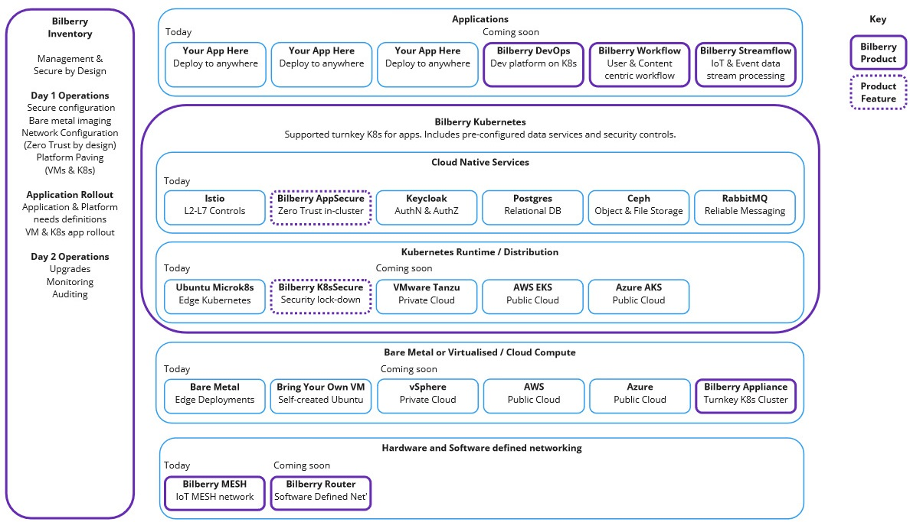

# Software

At Bilberry Software we believe in repeatable solutions. That's why over the years we've spotted gaps in the market and have created supported Open Source software to fill those gaps, saving time and money.

Below is an image representing our software portfolio. Please visit the separate product pages for further details.

## Bilberry Kubernetes and Bilberry Inventory

Bilberry Kubernetes takes your existing Kubernetes distribution and configures it with best practice security and performance configuration. We also layer on commonly required services such as reliable storage, relational database, and messaging software. This enables your applications to work immediately without having to source software and support for these components. For customers without their own or preferred Kubernetes distribution, we can provide supported licenses too.

Installing and configuration Kubernetes clusters can be a challenge, so we provide the Bilberry Inventory application to streamline and manage this process. You simply 'adopt' your bare metal servers, VMs, and other devices and instruct the Inventory which to create a running environment out of, and let the Inventory do the rest. This drastically simplifies Day 1 operations.

See the [Bilberry Kubernetes page](k8s.md) for more details.

## Easy Workflow and Easy Streamflow

We provide zero-code software to define human and content centric Workflows, as well as streaming data analysis and processing software, in our Easy Workflow and Easy Streamflow products, respectively. Please visit the [Easy Workflow](easyflow.md) page for more details.

## Third party open source software

We have experience of deploying a wide range of open source software in mission critical environments. We've used PostgreSQL, Redis, RabbitMQ, Kubernetes (many flavours), and many more leading open source solutions and designed, deployed and managed their installations for organisations.

## Why Commercial software powered by Open Source?

Many hands make light work. We built our software solutions on proven, reliable, and secure open source software that is deployed in thousands of companies worldwide. We also contribute patches and fixes to other open source projects so that the whole industry can benefit.

Equally though, organisations want to have a helping hand deploying, configuring, and maintaining these systems. This is where Bilberry Software can help. We can guide you through deploying these well proven solutions and can help you manage them, or even manage them for you.

## Ask us about your problems

Please do [Contact Us](contact-us.md) for a free one-hour remote Zoom consultation to discuss the problems you are facing. Even if we're not the right fit, we'll put you in touch with someone who can help through our extensive professional network across the globe.